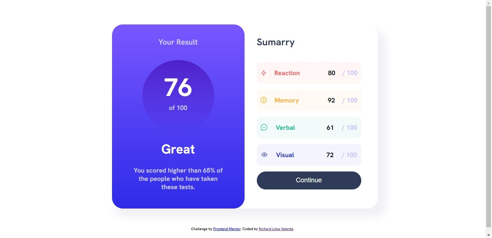

# Frontend Mentor - Results summary component solution

This is a solution to the [Results summary component challenge on Frontend Mentor](https://www.frontendmentor.io/challenges/results-summary-component-CE_K6s0maV). Frontend Mentor challenges help you improve your coding skills by building realistic projects. 

## Table of contents

- [Overview](#overview)
  - [The challenge](#the-challenge)
  - [Screenshot](#screenshot)
  - [Links](#links)
- [My process](#my-process)
  - [Built with](#built-with)
  - [What I learned](#what-i-learned)
  - [Continued development](#continued-development)
  - [Useful resources](#useful-resources)
- [Author](#author)
- [Acknowledgments](#acknowledgments)

## Overview

### The challenge

Users should be able to:

- View the optimal layout for the interface depending on their device's screen size
- See hover and focus states for all interactive elements on the page

### Screenshot

- Here is the screenshot of the result of my code. 

### Links

- Solution URL: [Add solution URL here](https://your-solution-url.com)
- Live Site URL: [Add live site URL here](https://your-live-site-url.com)

## My process

### Built with

- Semantic HTML5 markup
- CSS custom properties
- Flexbox
- CSS Grid

### What I learned

This is my first project without help or course going step by step.
I'm happy to have managed to get very close to the proposal of the challenge.
I learned a lot about how tags work, how they assume their positions with the use of the grid by CSS.

### Continued development

In the future, when learning how to use JavaScript I plan to re-code this site adding the part to enter the data and show the result with the specific text for each group of scores.

### Useful resources

I used these two websites to help understand some functions and solve doubts.

- [Mozzila Developer](https://developer.mozilla.org/pt-BR/docs/Web/HTML) 
- [W3Schools](https://www.w3schools.com/html/) 

## Author

- GitHub - https://github.com/RichardValente
- Linkedin - https://www.linkedin.com/in/richard-valente-57090b22/

